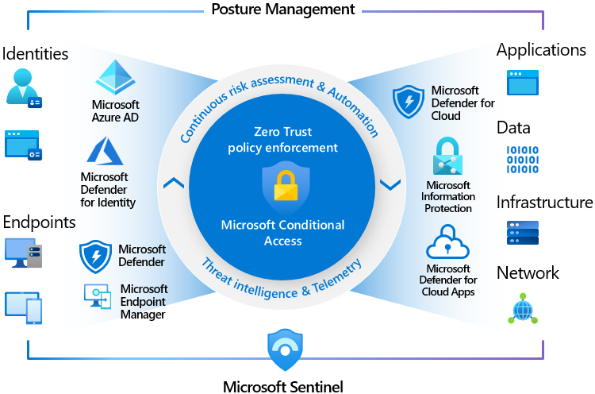
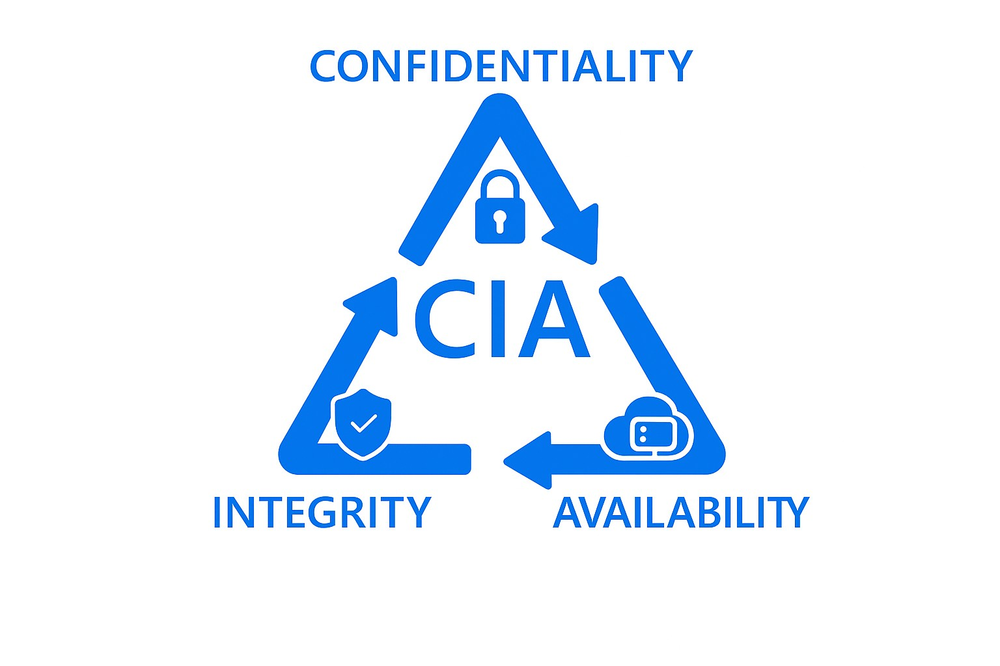

# Microsoft Azure Security Fundamentals - Understanding Microsoft's Defense in Depth Approach, Zero Trust and CIA Principles

## 1. What is Microsoft's Defense in Depth Approach?

Microsoft's Defense in Depth (DiD) Approach is a strategy built on multiple security layers. Think of it like a medieval castle: there is a front gate, outer walls, inner walls and a keep. Each layer adds an extra barrier which makes it much more difficult for the attackers to reach what matters most in your organization: your data, your users and your infrastructure.

In the cloud, these security layers represent different security controls. If one layer fails then you still have other layers to prevent a possible threat to your environment.
As for Microsoft, they support their customers with different Security tools like Microsoft Defender, Entra ID, Conditional Access and M365 Security to secure what your organization cares about the most.

## 2. Azure Security Layers

So, what are these security layers?
Well Microsoft's Defense in Depth strategy is built on 7 Security Layers. Each layer will focus on different aspects of Security. Together these layers will collaborate to secure your cloud environment against increasing and evolving threats.

### 2.1 Layer 1: The Physical Security Layer

As a customer, you will rarely or even never interact with this layer as it is Microsoft's responsibility as a public cloud provider. They secure and protect their own Azure datacenters with strict security mechanisms such as fences, cameras, badging systems and personnel screening.

These datacenters form the backbone of Azure. If you think the cloud is actually floating in the sky then you need to rethink that!
In reality, we as customers "rent" compute, storage and network resources from Microsoft using these highly secured facilities.

### 2.2 Layer 2: The Identity and Access Management Layer

In on-premises environments, traditionally, network security was considered the first line of Defense. In the cloud however, there is a big shift towards Identity and Access Management (IAM).

Why? In a public cloud, you don't have any control over the physical hardware or underlying network infrastructrure. That is solely the responsibility of the public cloud provider, which in our case is Microsoft. What you can control as customer is using the offerings and solutions of Microsoft to protect your identities. This makes identity security a lot more critical than ever.

All identities in Azure are stored in Entra ID, Microsoft's identity provider. Depending on your license, with Entra ID P2 license offering the most features, you can protect your identities in various ways and use a wide range of security controls and mechanisms.

Here are some core identity protection solutions:

* Multi-factor Authentication or MFA
* Conditional Access
* Privileged Identity Management or PIM
* Identity Protection

#### 2.2.1 Multi-Factor Authentication or MFA

Multi-Factor Authentication or MFA is a security mechanism that require users to use various and multiple verification methods besides a password to really prove who they say they are.

MFA typically combines 3 methods to make it work:

* Something you know: PIN or password
* Something you have: Phone or smart card
* Something you are:  Biometrics like fingerprint or face recognition.

#### 2.2.2 Conditional Access

Conditional Access is a security mechanism in Entra ID that serves as an engine in your environment to enforce access policies based on configured conditions. It is a key component of the Zero Trust Security model.

In short, Conditional Access lets you define rules on how your users can access organizational resources. Conditional Access will evaluate a lot of signals before granting access to a business resource.

These signals can be: what is the user identity, from which location are they signing in, is the device state compliant or not, to which application does a user want access, are they a risky user os perhaps the sign-in is quite risky, etc...

All these factors will determine if a user can access organizational resources or not.

#### 2.2.3 Privileged Identity Management

Privileged Identity Management or PIM is a feature in Entra ID that lets you manage, control and monitor privileged access to resources in both Azure and M365. This feature requires an Entra P2 license.

Actually you can see PIM as Just-in-Time Access. You only activate your permissions or roles when you need them and this with a least privilege mindset. It eliminates having permanent permissions on resources in Azure or M365, which strengthens your Identity Security and reduces the risks in case of a compromised account or credential theft.

#### 2.2.4 Identity Protection

Identity Protection is a feature in Entra ID, that detects, prevent and respond to identity-related risks using machine learning and risk-based policies. It identifies risky sign-ins and risky users, assign appropriate risk-levels and will respond automatically through Conditional Access policies.

### 2.3 Layer 3: The Perimeter Security Layer

The Perimeter Security layer is all about protecting the outer boundary of your cloud environment. You can see it as the first line of defense against external threats before traffic reaches your internal network resources. Similar to a fence or the first wall of your castle. In Azure this means that only trusted traffic enters and malicious traffic is blocked. In practice, there are a couple of solutions which we can link to this 3rd layer: Azure Firewall and DDoS Protection.

#### 2.3.1 Azure Firewall

Azure Firewall is a managed, cloud-based network security service that protects your Azure Virtual Network resources. It is a stateful firewall as a service with built-in high availability and unrestricted cloud scalability.

#### 2.3.2 DDoS Protection

DDoS Protection is a service that protects your applications from Distributed Denial of Service (DDoS) attacks. These attacks try to make your applications unavailable by overwhelming them with traffic from multiple sources. Azure DDoS Protection provides enhanced DDoS mitigation capabilities to defend against these attacks.

### 2.4 Network Security

Network Security focuses on protecting the internal network traffic within your cloud environment. This layer ensures that only authorized communication occurs between different resources and services. Key components of Network Security in Azure include Network Security Groups (NSGs), Azure Virtual Network (VNet) Peering, and Azure Bastion.

#### 2.4.1 Network Security Groups

Network Security Groups (NSGs) are a critical component of Azure's network security. They act as virtual firewalls that control inbound and outbound traffic to and from Azure resources within a Virtual Network (VNet). NSGs contain security rules that allow or deny traffic based on source and destination IP addresses, ports, and protocols.

#### 2.4.2 Azure Virtual Networks

Azure Virtual Networks (VNets) are fundamental building blocks for your private network in Azure. They enable secure communication between Azure resources, on-premises networks, and the internet. VNets provide isolation and segmentation of your resources, allowing you to create subnets, define IP address ranges, and implement network security policies.

#### 2.4.3 Azure Virtual Network Peering

Azure Virtual Network Peering enables you to connect two or more VNets in the same or different Azure regions. This allows resources in different VNets to communicate with each other as if they were part of the same network. VNet Peering provides low-latency, high-bandwidth connectivity between VNets, enhancing network security and performance.

#### 2.4.4 Azure Bastion

Azure Bastion is a fully managed service that provides secure and seamless RDP and SSH connectivity to your virtual machines directly through the Azure portal. It eliminates the need for public IP addresses on your VMs, reducing exposure to potential threats from the internet. Azure Bastion ensures that all connections are encrypted and protected, enhancing the overall security of your compute resources.

### 2.5 Compute Security

Compute Security focuses on securing the virtual machines (VMs) and containers that run your applications and services in Azure. This layer ensures that your compute resources are protected from vulnerabilities and threats. A key component of Compute Security in Azure include Defender for Cloud.

#### 2.5.1 Defender for Cloud

Defender for Cloud is a comprehensive security management solution that provides advanced threat protection for your Azure resources. It offers continuous security assessment, threat detection, and vulnerability management for your virtual machines, containers, and other compute resources. Defender for Cloud helps you identify and mitigate security risks, ensuring that your compute environment remains secure and compliant.

### 2.6 Application Security

Application Security focuses on protecting the applications and services that run in your cloud environment. This layer ensures that your applications are secure from vulnerabilities and threats. Key components of Application Security in Azure include Azure Application Gateway, Azure Web Application Firewall (WAF), and Azure API Management.

#### 2.6.1 Azure Application Gateway

Azure Application Gateway is a web traffic load balancer that enables you to manage traffic to your web applications. It provides features such as SSL termination, URL-based routing, and session affinity. Application Gateway enhances the security of your applications by providing a secure entry point and protecting against common web vulnerabilities.

#### 2.6.2 Azure Web Application Firewall

Azure Web Application Firewall (WAF) is a feature of Azure Application Gateway that provides centralized protection for your web applications from common threats and vulnerabilities. WAF uses a set of pre-defined rules to detect and block malicious traffic, such as SQL injection and cross-site scripting attacks. It helps ensure that your applications remain secure and compliant with industry standards.

#### 2.6.3 Azure API Management

Azure API Management is a fully managed service that enables you to create, publish, and manage APIs securely. It provides features such as authentication, authorization, rate limiting, and monitoring. API Management helps protect your APIs from unauthorized access and abuse, ensuring that your applications can communicate securely with other services.

### 2.7 Data Security

Data Security focuses on protecting the data that is stored and processed in your cloud environment. This layer ensures that your data is secure from unauthorized access and breaches. Key components of Data Security in Azure include Azure Key Vault, Azure Information Protection, and Azure SQL Database security features.

#### 2.7.1 Azure Key Vault

Azure Key Vault is a cloud service that provides secure storage and management of cryptographic keys, secrets, and certificates. It helps protect sensitive data by enabling you to control access to your keys and secrets using role-based access control (RBAC) and policies. Key Vault also integrates with other Azure services, allowing you to securely manage encryption keys for your applications and data.

#### 2.7.2 Azure Information Protection

Azure Information Protection (AIP), now integrated in Microsoft Purview Information Protection is a set of tools that helps you classify, label, and protect sensitive information. AIP enables you to apply labels to documents and emails based on their sensitivity, and enforce protection policies such as encryption and access restrictions. This helps ensure that your sensitive data remains secure, even when it is shared outside your organization.

#### 2.7.3 Azure SQL Database security

Azure SQL Database offers several built-in security features to protect your data, including Transparent Data Encryption (TDE), Advanced Threat Protection, and Vulnerability Assessments. TDE encrypts your data at rest, while Advanced Threat Protection detects and responds to potential threats. Vulnerability Assessments help you identify and remediate security vulnerabilities in your database.

## 3. Confidentiality, Integrity, Availability (CIA) - The Three Pillars of Cybersecurity

Cybersecurity is built on 3 fundamental principles: Confidentiality, Integrity and Availability.
In the industry this is often referred to as the CIA Triad.

### 3.1 Confidentiality

The principle of Confidentiality means that your information needs to be kept private at all times. Also ensure that only individuals with the proper authorization can access your resources. Following this principle prevents data leaks and avoids sensitive data from falling into the hands of a malicious actor.

### 3.2 Integrity

The principle of Integrity means that you have to ensure that your data remains accurate and trustworthy. Unauthorized changes to your organizations data should be prevented by all means and all time. No one should be able to tamper with your information or even deleting this information unless they have explicit permission to do so.

### 3.3 Availability

The principle of Availability means you have to ensure access to your organizational resources and data whenever you need them. A common technique to disrupt systems and thus the availability of your data is DDoS or Distributed Denial of Service attacks. In short this technique will try to disrupt your systems by flooding them with traffic which results into your systems being inaccessible. To make your systems accessible, malicious actors often demand ransom.

## 4. Zero Trust Security Strategy

The Zero Trust Strategy is a security strategy based on the principle of "never trust, always verify." This means that no user, device or network location is trusted, whether inside or outside your corporate network. These days we are in a flexible work environment, where employees access resources from literally everywhere, the attack surface has expanded significantly. Organizations must adopt Zero Trust to reduce risk and protect critical assets.

The Zero Trust Strategy is based on three core principles, which I will elaborate further below.

### 4.1 Principle 1: Verify Explicitly

Every user and device must be verified before granting access to any resource. This means that even if a user is authenticated, they still need to be validated against a set of policies and conditions before being granted access.

### 4.2 Principle 2: Least Privilege Access

Access to resources should be granted based on the principle of least privilege. This means that users should only be given the minimum level of access necessary to perform their job functions. This reduces the risk of unauthorized access and limits the potential damage that can be caused by a compromised account.

### 4.3 Principle 3: Assume Breach

Organizations should assume that their systems have already been compromised and design their security measures accordingly. This means implementing strong monitoring and detection capabilities, as well as having a robust incident response plan in place.

## 5. Conclusion

Microsoft’s Defense in Depth approach provides a robust, layered security strategy that protects every aspect of your cloud environment.

From physical infrastructure to identity, network, application, and data security. When combined with Cybersecurity principles like the CIA Triad and Zero Trust Methodology, this framework ensures resilience against today’s evolving cyber threats.

Cloud Security is not a one-time effort. It’s an ongoing process that requires continuous monitoring, adaptation, and improvement. By adopting these foundations, you’re building a strong defense that evolves with your organization’s needs.

---

### What's next?

Now that you understand how Microsoft secures the cloud, it’s time to explore Azure from the ground up. In the next article, we’ll take a step back and explore the basics of Microsoft Azure covering: core services, architecture, and how to start building in the cloud securely.
