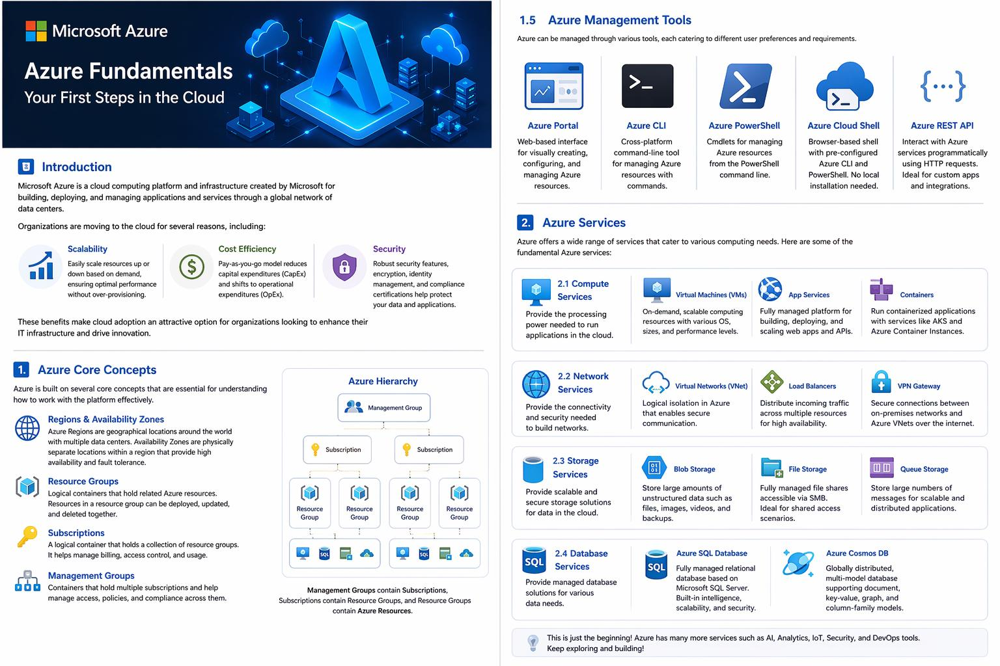
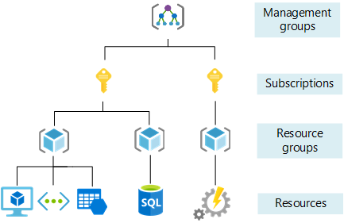
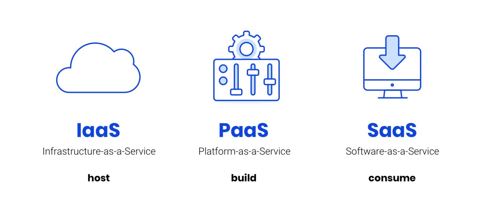
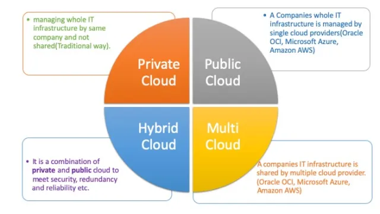
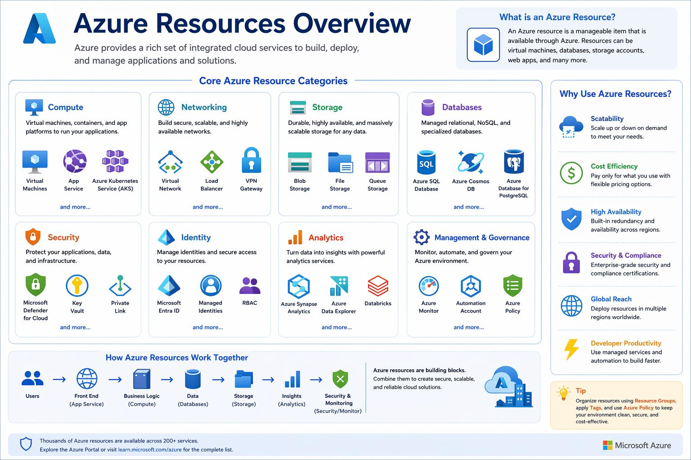
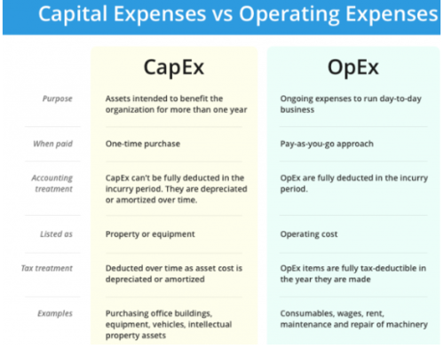
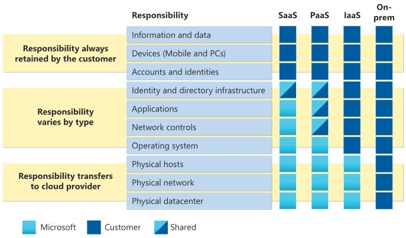
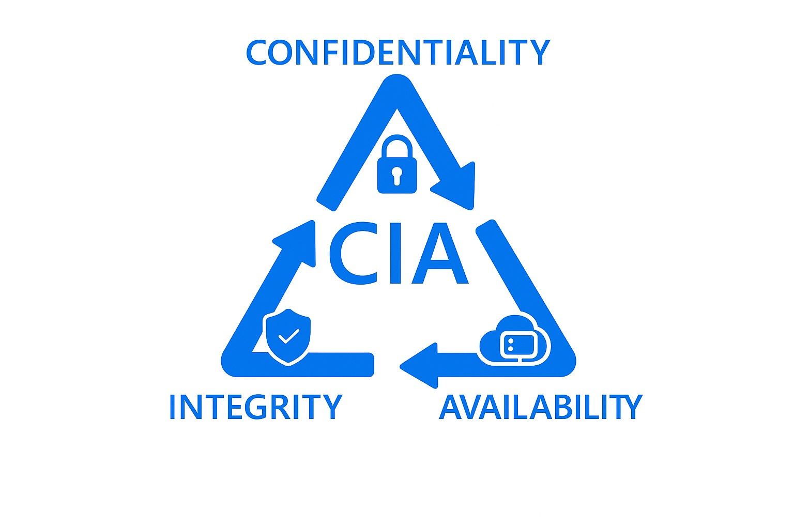

# Microsoft Azure Fundamentals – Your First Steps in the Cloud

## Introduction

Microsoft Azure is a cloud computing platform and infrastructure created by Microsoft for building, deploying, and managing applications and services through a global network of data centers. This article aims to provide a foundational understanding of Azure, its core concepts, services, and best practices for beginners.

Organizations are moving to the cloud for several reasons, including:

- **Scalability**: Cloud platforms like Azure allow organizations to easily scale their resources up or down based on demand, ensuring optimal performance without over-provisioning.
- **Cost Efficiency**: By adopting a pay-as-you-go model, organizations can reduce capital expenditures (CapEx) and shift to operational expenditures (OpEx), paying only for the resources they use. This flexibility helps in managing budgets more effectively.
- **Security**: Azure provides robust security features, including encryption, identity management, and compliance certifications, helping organizations protect their data and applications in the cloud.  These benefits make cloud adoption an attractive option for organizations looking to enhance their IT infrastructure and drive innovation.

## 1. Azure Core Concepts

Azure is built on several core concepts that are essential for understanding how to work with the platform effectively.

### 1.1 Azure Regions & Availability Zones

Azure Regions are geographical locations around the world where Microsoft has its Azure data centers. Each region consists of multiple data centers that are interconnected through a low-latency network. Availability Zones are physically separate locations within an Azure region that provide high availability and fault tolerance for applications and services deployed in Azure.

### 1.2 Azure Hierarchy and Structure

### 1.3 Resource Groups

Resource Groups are logical containers that hold related Azure resources. They help organize and manage resources based on their lifecycle, permissions, and policies. Resources within a resource group can be deployed, updated, and deleted together.

### 1.4 Subscriptions

An Azure Subscription is a logical unit that holds a collection of Azure resource groups. It provides a way to manage and organize resources, track usage and billing, and apply policies and access controls. Each subscription has its own billing account and can be associated with different resource groups and services.

### 1.5 Management Groups

Management Groups are top-level organizational units that hold multiple subscriptions and provide a way to manage access, policies, and compliance across those subscriptions.

### 1.6 Azure Management Tools

Azure can be managed through various tools, each providing to different user preferences and requirements.

### 1.6.1 Azure Portal

The Azure Portal is a web-based interface that allows users to manage and monitor Azure resources visually. It provides a user-friendly experience for creating, configuring, and managing resources through a graphical interface.

### 1.6.2 Azure CLI

The Azure Command-Line Interface (CLI) is a cross-platform command-line tool that allows users to manage Azure resources using commands. It is suitable for automation and scripting tasks.

### 1.6.3 Azure PowerShell

Azure PowerShell is a set of cmdlets for managing Azure resources directly from the PowerShell command line. It is particularly useful for Windows users and those familiar with PowerShell scripting.

### 1.6.4 Azure Cloud Shell

Azure Cloud Shell is an online shell environment accessible through the Azure Portal. It provides users with a pre-configured environment that includes both Azure CLI and Azure PowerShell, allowing for quick access to manage Azure resources without needing to install any software locally.

### 1.6.5 Azure REST API

The Azure REST API allows developers to interact with Azure services programmatically using HTTP requests. It is useful for building custom applications and integrations with Azure.

## 2. Cloud Service Models

When working with Azure or any cloud platform, it is essential to understand the different service models. These define how much responsibility remains with the customer versus what is managed by the cloud provider.

### 2.1 Infrastructure as a Service (IaaS)

Infrastructure as a Service provides the most control over your environment. You are responsible for managing operating systems, applications and configurations, while Azure manages the underlying infrastructure.

##### Typical characteristics:

- Full control over virtual machines
- Custom operating system and software installation
- High flexibility but also higher management overhead

Example in Azure are: Virtual Machines, Virtual Networks

### 2.2 Platform as a Service (PaaS)

Platform as a Service removes the need to manage the underlying operating system and infrastructure. Azure manages the platform, allowing you to focus on application development and deployment.

##### Typical characteristics:

- No OS management required
- Built in scalability and patching
- Faster development cycles

Example in Azure are: Azure App Services, Azure SQL Database

### 2.3 Software as a Service (SaaS)

Software as a Service provides fully managed applications hosted in the cloud. Users simply consume the application without managing infrastructure or platforms.

##### Typical characteristics:

- No infrastructure or platform management
- Accessible via browser or API
- Subscription based licensing

Example: Microsoft 365

## 3. Cloud Deploymend Models

In addition to service models, organizations also choose how their cloud environment is deployed. This depends on security, compliance and operational requirements.

### 3.1 Public Cloud

In a public cloud model, all resources are owned and operated by a cloud provider like Microsoft.

##### Typical characteristics:

- Shared infrastructure across customers
- High scalability and flexibility
- Pay as you go pricing

Example: Microsoft Azure

### 3.2 Private Cloud

A private cloud is dedicated to a single organization. It can be hosted on premises or by a provider.

##### Typical characteristics:

- Fully isolated environment
- Greater control over security and compliance
- Higher cost and maintenance effort

Example: VMWare environment in an organizations own data center.

### 3.3 Hybrid Cloud

Hybrid cloud combines on premises infrastructure with public cloud services.

##### Typical characteristics:

- Seamless integration between environments
- Flexibility to keep sensitive workloads on premises
- Gradual cloud adoption

Example: On premises servers connect to Azure via VPN

### 3.4 Multi-cloud

Multi-cloud refers to using multiple cloud providers at the same time.

##### Typical characteristics:

- Avoid vendor lock in
- Improved resilience and redundancy
- Increased operational complexity

Example: Workloads running in Azure & AWS

## 4. Azure Services

Azure offers a wide range of services that cater to various computing needs. Here are some of the fundamental Azure services:

### 4.1 Azure Compute Services

Azure Compute Services provide the processing power needed to run applications and services in the cloud. There are several compute options available in Azure, including:
Virtual Machines (VMs), Azure App Services, Azure Containers and much more.

#### 4.1.1 Virtual Machines (VMs)

Virtual Machines are on-demand, scalable computing resources that allow users to run applications and services in the cloud. They can be configured with different operating systems, sizes, and performance levels to meet specific requirements.

#### 4.1.2 Azure App Services
Azure App Services is a fully managed platform for building, deploying, and scaling web applications and APIs. It supports multiple programming languages and frameworks, making it easy to develop and host applications in the cloud.

#### 4.1.3 Azure Containers

Containers are lightweight, portable units that package applications and their dependencies together. Azure provides several container services, including Azure Kubernetes Service (AKS) and Azure Container Instances (ACI), to help users deploy and manage containerized applications.

### 4.2 Azure Network Services

Azure Network Services provide the connectivity and security needed to build and manage networks in the cloud. There are several network services available in Azure, including:
Virtual Networks, Load Balancers, VPN Gateway and much more.

#### 4.2.1 Virtual Networks (VNet)

Virtual Networks (VNet) are logical isolation of the Azure cloud dedicated to a subscription. They enable secure communication between Azure resources, on-premises networks, and the internet.

#### 4.2.2 Load Balancers

Load Balancers distribute incoming network traffic across multiple resources to ensure high availability and reliability of applications.

#### 4.2.3 VPN Gateway

VPN Gateway enables secure connections between on-premises networks and Azure virtual networks over the internet using IPsec/IKE protocols.

### 4.3 Azure Storage Services

Azure Storage Services provide scalable and secure storage solutions for data in the cloud. There are several storage options available in Azure, including:
Blob Storage, File Storage, Queue Storage and much more.

#### 4.3.1 Blob Storage

Blob Storage is a service for storing large amounts of unstructured data, such as text or binary data. It is ideal for storing files, images, videos, and backups.

#### 4.3.2 File Storage

File Storage provides fully managed file shares in the cloud that can be accessed via the SMB protocol. It is suitable for scenarios that require shared access to files across multiple virtual machines.

#### 4.3.3 Queue Storage

Queue Storage is a service for storing large numbers of messages that can be accessed from anywhere in the world via authenticated calls using HTTP or HTTPS. It is useful for building scalable and distributed applications.

### 4.4 Azure Database Services

Azure Database Services provide managed database solutions for various data storage needs. There are several database options available in Azure, including:
Azure SQL Database, Cosmos DB and much more.

#### 4.4.1 Azure SQL Database

Azure SQL Database is a fully managed relational database service based on Microsoft SQL Server. It offers built-in intelligence, scalability, and security features.

#### 4.4.2 Azure Cosmos DB

Azure Cosmos DB is a globally distributed, multi-model database service that supports various data models, including document, key-value, graph, and column-family. It is designed for high availability and low latency.

## 5. The basics of Identity & Access

To effectively manage and secure access to Azure resources, it is essential to understand the fundamentals of identity and access management in Azure. This section covers key concepts such as Entra ID, Role-based Access Control (RBAC), and the importance of identity in modern cloud security.

### 5.1 Entra ID as Identity Provider (IdP)

Entra ID (formerly known as Azure Active Directory) is Microsoft's cloud-based identity and access management service. It provides a robust platform for managing user identities, authentication, and access to resources in Azure and other Microsoft services. Entra ID supports various authentication methods, including multi-factor authentication (MFA), single sign-on (SSO), and conditional access policies to enhance security.

### 5.2 Role-based Access Control (RBAC)

Role-based Access Control (RBAC) is a method of managing access to Azure resources based on the roles assigned to users, groups, or applications. RBAC allows administrators to define granular permissions for different roles, ensuring that users only have access to the resources they need to perform their tasks. Common built-in roles include Owner, Contributor, and Reader, but custom roles can also be created to meet specific requirements.

### 5.3 Why is Identity the new perimeter?

In the modern cloud computing landscape, traditional network perimeters are becoming less relevant due to the increasing adoption of cloud services, remote work, and mobile devices. Identity has emerged as the new perimeter because it serves as the primary means of controlling access to resources, regardless of the user's location or device. By focusing on identity-based security measures, organizations can better protect their resources from unauthorized access and potential threats.

## 6. Cost Management in Azure

Now, how does Azure pricing work? Understanding the pricing models and cost management tools available in Azure is crucial for optimizing expenses and ensuring efficient resource utilization.

### 6.1 Pricing Models

Azure offers several pricing models to accommodate different usage patterns and budget requirements.

#### 6.1.1 CapEx versus OpEx (Pay-as-you-go model)

##### 6.1.1.1 Capital Expenditure (CapEx)

Capital Expenditure refers to an organization investing a budget upfront in physical assets such as hardware to meet its business requirements. Organizations typically need to forecast their needs over multiple years and allocate funding accordingly, which often results in significant initial costs.

This model also has limited flexibility. Once the investment is made, scaling the IT infrastructure up or down becomes more complex and time consuming, as it requires additional capital investments or results in underutilized resources.

##### 6.1.1.2 Operating Expenditure (OpEx)

Operating Expenditure, often referred to as the pay as you go model, allows organizations to pay only for the resources they actually consume. Costs are typically calculated on a per use basis, such as hourly or per second, depending on the service.

This model provides a high level of flexibility and scalability. Organizations can quickly adjust resource consumption based on demand without the need for upfront investments. As a result, it is particularly suitable for workloads with variable or unpredictable usage patterns.

#### 6.1.2 Azure Reserved Instances

Azure Reserved Instances allow users to commit to using specific Azure resources for a one- or three-year term in exchange for significant cost savings compared to the pay-as-you-go model. This model is suitable for predictable workloads with consistent resource requirements.

### 6.2 Azure Cost Management Tools

Azure provides several tools to help users monitor, analyze, and optimize their cloud spending.

#### 6.2.1 Total Cost of Ownership

Total Cost of Ownership (TCO) is a financial estimate that helps organizations understand the direct and indirect costs associated with deploying and managing resources in Azure compared to on-premises infrastructure. The TCO calculator provides insights into potential cost savings and benefits of migrating to the cloud.

#### 6.2.2 Azure Pricing Calculator

The Azure Pricing Calculator is an online tool that allows users to estimate the costs of various Azure services based on their specific configurations and usage patterns. It helps users plan and budget for their cloud deployments effectively.

## 7. Azure Security Basics

Looking to the security aspect of Azure, it is essential to understand the shared responsibility model, built-in security features, and best practices for securing resources in the cloud.

### 7.1 Shared Responsibility Model

The Shared Responsibility Model outlines the division of security responsibilities between Microsoft and the customer. Microsoft is responsible for securing the underlying infrastructure, including data centers, networks, and physical hardware. Customers are responsible for securing their data, applications, and configurations within Azure. Understanding this model is crucial for implementing effective security measures and ensuring compliance with organizational policies.

### 7.2 Defender for Cloud

Defender for Cloud is a comprehensive security management solution that provides advanced threat protection for Azure resources. It offers features such as continuous security assessments, vulnerability management, and threat detection to help organizations identify and mitigate potential security risks. Defender for Cloud integrates with other Azure security services to provide a unified view of an organization's security posture.

### 7.3 Zero Trust & CIA Triad as guiding principles

The Zero Trust security model is based on the principle of "never trust, always verify." It emphasizes the need for continuous authentication and authorization of users and devices, regardless of their location or network. The CIA Triad (Confidentiality, Integrity, Availability) serves as a foundational framework for information security, guiding organizations in protecting their data and resources from unauthorized access, ensuring data accuracy, and maintaining system availability.

## 8. How to get started in Azure

So how do you get started with Azure? This section provides practical steps for beginners to create an Azure account, deploy their first resource, and follow best practices for junior IT Cloud Professionals.

### 8.1 Free Azure trial account

To get started with Azure, you can create a free Azure trial account. The free trial account provides access to a limited set of Azure services and resources for a specified period, typically 30 days, along with a credit amount to explore and experiment with Azure services. To create a free trial account, visit the Azure website and follow the sign-up process, which includes providing personal information and payment details (note that you won't be charged until you exceed the free credit limit or the trial period ends).

### 8.2 First deployment of your resource

Once you have created your Azure account, you can deploy your first resource using the Azure Portal. Here are the basic steps to deploy a virtual machine (VM) as an example:

1. Log in to the Azure Portal using your credentials.
2. Click on "Create a resource" in the left-hand menu.
3. Select "Compute" and then choose "Virtual Machine."
4. Fill in the required details, such as the VM name, region, size, and operating system.
5. Configure additional settings, such as networking, storage, and security options.
6. Review the configuration and click "Create" to deploy the VM.
7. Once the deployment is complete, you can access and manage your VM through the Azure Portal or other management tools.

### 8.3 Best practices for junior IT Cloud Professionals

When starting with Azure, it is essential to follow best practices to ensure efficient resource management, security, and cost optimization. Here are some key best practices for junior IT Cloud Professionals:

#### 8.3.1 Naming conventions

Establishing consistent naming conventions for Azure resources helps improve organization, management, and identification of resources. A well-defined naming convention should include information such as resource type, environment (e.g., dev, test, prod), region, and a unique identifier. For example, a virtual machine in the production environment located in the East US region could be named "vm-prod-eastus-001."

#### 8.3.2 Tagging

Tagging resources in Azure allows for better organization, cost allocation, and management. Tags are key-value pairs that can be applied to Azure resources to categorize and track them. For instance, you might tag a resource with "Environment: Production" or "Project: WebApp." This helps in filtering and managing resources more effectively.

#### 8.3.3 Monitoring

Implementing monitoring solutions is crucial for maintaining the health and performance of Azure resources. Azure provides built-in monitoring tools, such as Azure Monitor and Application Insights, which allow you to track metrics, logs, and alerts. Regularly reviewing monitoring data helps identify potential issues, optimize resource usage, and ensure compliance with performance standards.

#### 8.3.4 Security best practices

- Regularly review and update access controls using Role-based Access Control (RBAC) to ensure that users have the minimum necessary permissions.
- Enable multi-factor authentication (MFA) for all users to enhance account security.
- Regularly apply security patches and updates to Azure resources to protect against vulnerabilities.
- Utilize Azure Security Center to monitor and manage the security posture of your Azure environment.
- Implement network security measures, such as Network Security Groups (NSGs) and Azure Firewall, to control inbound and outbound traffic to your resources.
- Conduct regular security assessments and audits to identify and mitigate potential risks.
- Educate users about security best practices and the importance of safeguarding sensitive information.

## 9. Conclusion

Microsoft Azure offers a robust and flexible cloud computing platform that enables organizations to build, deploy, and manage applications and services efficiently. By understanding the core concepts, services, and best practices outlined in this article, beginners can take their first steps in the cloud with confidence. As you continue your journey with Azure, remember to stay updated with the latest features and advancements to maximize the benefits of cloud computing for your organization. Embrace the cloud and explore the endless possibilities that Azure has to offer. 